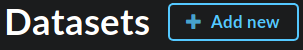
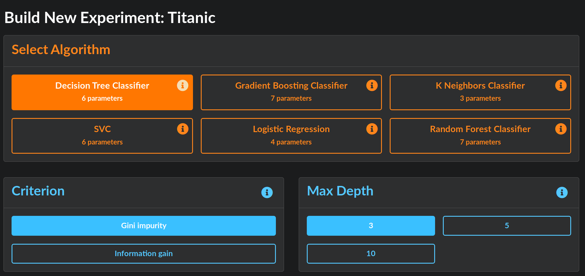

Analysis Quickstart 
===================

This guide shows you how to construct your own experiment, construct an AI experiment, and view and download results.
It assumes you have already installed PennAI (see :ref:`user-guide`). 

.. image:: _static/landing_page.png
    :width: 400
    :alt: Dataset elements on the landing page. 
    :align: center

The landing page for PennAI shows you your datasets. 
For datasets with results, a blue bar indicates the best performance achieved so far, along with the algorithm description.
Experiments that are running or finished will appear here as well. 
Click on the name of the dataset to see information about it, including a data preview and metafeatures. 

===================
Uploading a dataset
===================

Upload a dataset by clicking the "+ Add new" button.
This will take you to the Dataset Upload screen where you can select a .csv or .tsv file to upload. 
You will see a preview of the data. 
Specify the name of the dependent column, as well as any nominal or ordinal features.
Some example datasets can be found in the classification section of the `Penn Machine Learning Benchmarks github repository <https://github.com/EpistasisLab/penn-ml-benchmarks/tree/master/datasets/classification>`_. 

============================
Building your own experiment
============================

Click `Build New Experiment` at the bottom of your dataset box. 
This takes you to the experiment building page. 

Select from one of the ML algorithms at the top. 
Its default parameters will be selected in blue.
Choose the parameter settings for the algorithm and click `Launch Experiment`.
You will be navigated to the **Experiments** page. 

===========
AI analysis
===========

To allow the AI to choose experiments for you, simply toggle on the AI button in the upper right corner of the dataset box.
The AI will then run one or more experiments for which it chooses its own algorithms to run.
Progress can be viewed from the Experiments page.
To configure the AI settings (for example, the number of experiments to run or time limits), see the configuration file in `config/ai.env`. 

.. image:: _static/ai_requested.png
    :width: 400
    :alt: Experiment building page. 
    :align: center

===========
Experiments 
===========

.. image:: _static/experiments.png
    :width: 600
    :alt: Experiment building page. 
    :align: center

The Experiments page lists information about current experiments, including start time, status, and performance. 
By filtering by Algorithm, you can see the algorithm's parameters for each experiment. 
In the Actions column on the right, you may download files to reproduce your results:

- **Download model** downloads a pickled model file that contains the trained model.
  Use it to run analysis on more datasets.
- **Download script** gives you a Python script to reproduce the analysis in the experiment.

Clicking on any experiment will navigate to the **Results** page. 

=======
Results
=======

.. image:: _static/results.png
    :width: 600
    :alt: The Results page. 
    :align: center

The Results page summarizes the experiment results through figures and statistics. 
The algorithm configuration and runtime information is displayed on the left.
On the right, the training and testing balances accuracies are shown.
For every experiment, the top 10 most important features are shown in a bar plot on the bottom left.
For every classification problem, a confusion matrix is shown. 
For binary classification, an ROC curve and AUC score is provided.

