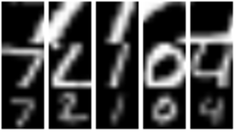

# Recurrent Attention Model (FGMachine)

## Introduction

The Recurrent Attention Model (RAM) [1] is a recurrent neural network that uses the REINFORCE algorithm [2] to take multiple *glimpses* of its 2D spatial input. At every time step, the RAM produces both the location for its next glimpse, and potentially an action, such as a classification of its input data. This example comes in both a standard version (requiring Torch7) and a Docker version (requiring Docker but not Torch7).

This example has been adapted from [Recurrent Model of Visual Attention](http://torch.ch/blog/2015/09/21/rmva.html).

## Requirements (Torch7)

- [Torch7](http://torch.ch/)
- [torchx](https://github.com/nicholas-leonard/torchx)
- [dpnn](https://github.com/nicholas-leonard/dpnn)
- [rnn](https://github.com/Element-Research/rnn)
- [mnist](https://github.com/andresy/mnist)

`luarocks install <package>` can be used to install the `torchx`, `dpnn`, `rnn` and `mnist` libraries once Torch7 is installed.

## Requirements (Docker)

- [Docker](https://www.docker.com/)

For more information on Docker usage, including CUDA capabilities, please see the [source repo](https://github.com/Kaixhin/dockerfiles).

## Instructions (Torch7)

1. Set up [FGLab](https://github.com/Kaixhin/FGLab/blob/master/examples/Recurrent-Attention-Model).
1. Insert the first [project](project.json) into FGMachine's `projects.json` file, using the project ID from FGLab.
1. [Submit an experiment](https://github.com/Kaixhin/FGLab/blob/master/examples/Recurrent-Attention-Model).

## Instructions (Docker)

1. Create a Docker image for this example by running `sudo docker build -t ram .` in this folder.
1. Set up [FGLab](https://github.com/Kaixhin/FGLab/blob/master/examples/Recurrent-Attention-Model).
1. Run FGMachine with superuser privileges (to allow spawning Docker containers).
1. Insert the second [project](project.json) into FGMachine's `projects.json` file, using the project ID from FGLab, and adding the absolute path for this folder.
1. [Submit an experiment](https://github.com/Kaixhin/FGLab/blob/master/examples/Recurrent-Attention-Model).

Note that since the Docker container is ephemeral, the arguments to Docker mounts this directory as `/data` inside the container, and `main.lua` writes the results to this directory. The code to check whether the script is running within a Docker container is only used so that the same file can be used in both normal and Docker environments.

For CUDA capabilities, use the `kaixhin/cuda-torch` base image can be used. Dockerfiles that build from this image are also included. For example, to use CUDA 7.5, run `sudo docker build -t ram -f Dockerfile_cuda_v7_5 .`. For more information, see the notes on [CUDA in Docker](https://github.com/Kaixhin/dockerfiles#cuda).

## Results

The code produces a plot of the training losses, and calculates the accuracy of the RAM on the test set after training. In addition the policy for taking glimpses is visualised, providing `glimpse<x>.png` for the first 5 test images, where `<x>` is the time step, as shown below:

For each glimpse, the extracted patches, `patch<x>.png`, are also extracted:

These images are displayed along with the normal download link for uploaded files.

## Citations

[1] Mnih, V., Heess, N., & Graves, A. (2014). Recurrent models of visual attention. In *Advances in Neural Information Processing Systems* (pp. 2204-2212).

[2] Williams, R. J. (1992). Simple statistical gradient-following algorithms for connectionist reinforcement learning. *Machine learning*, 8(3-4), 229-256.
